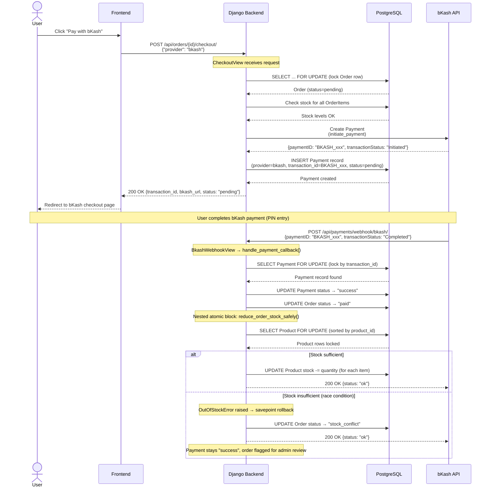

# bKash Payment Flow

## Sequence Diagram

## bKash-Specific Notes

1. **Redirect flow:** Unlike Stripe's embedded form, bKash uses a redirect-based checkout. The `bkash_url` returned from `initiate_payment()` redirects the user to the bKash payment page.

2. **Transaction status mapping:**
   | bKash Status | Internal Status |
   |---|---|
   | `Completed` | `success` |
   | `Failed` | `failed` |
   | `Cancelled` | `failed` |
   | `Initiated` | `pending` |

3. **Same webhook handler:** Both Stripe and bKash webhooks are processed by the same `handle_payment_callback()` service function. The Strategy Pattern's `verify_payment()` method normalizes each provider's payload into a common format before processing.
