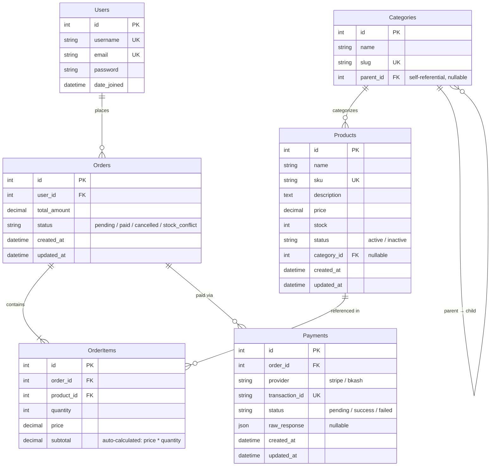

# Entity Relationship Diagram

## Overview

This ERD covers the five core tables of the e-commerce system: Users, Products, Categories, Orders, OrderItems, and Payments.

## ERD (Mermaid)

## Table Relationships

| Relationship | Type | Constraint |
|---|---|---|
| Users → Orders | One-to-Many | `CASCADE` (delete user deletes orders) |
| Orders → OrderItems | One-to-Many | `CASCADE` (delete order deletes items) |
| Products → OrderItems | One-to-Many | `PROTECT` (cannot delete product with existing orders) |
| Categories → Products | One-to-Many | `SET_NULL` (delete category sets product.category to NULL) |
| Categories → Categories | Self-referential | `CASCADE` (delete parent deletes children) |
| Orders → Payments | One-to-Many | `CASCADE` (delete order deletes payments) |

## Indexed Fields

| Table | Field | Index Type |
|---|---|---|
| Products | `sku` | Unique Index |
| Categories | `slug` | Unique Index |
| Payments | `transaction_id` | Unique Index |
| Users | `email` | Unique Index |
| Users | `username` | Unique Index |
| Orders | `user_id` | FK Index (auto) |
| OrderItems | `order_id` | FK Index (auto) |
| OrderItems | `product_id` | FK Index (auto) |
| Payments | `order_id` | FK Index (auto) |
| Products | `category_id` | FK Index (auto) |
