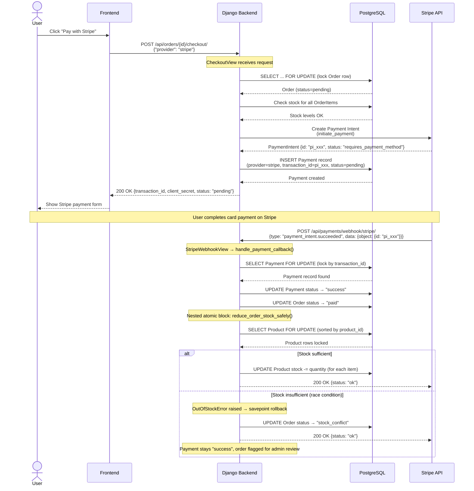

# Stripe Payment Flow

## Sequence Diagram

## Key Design Decisions

1. **Pre-checkout stock validation:** Before calling Stripe, we check stock levels to avoid unnecessary payment intents for out-of-stock products.

2. **Post-payment stock reduction:** Stock is only deducted *after* payment confirmation via webhook, not during checkout initiation. This prevents stock being "reserved" for abandoned payments.

3. **Savepoint isolation:** If stock runs out between checkout and webhook (race condition), the payment record stays `success` but the order is marked `stock_conflict`. This ensures billing accuracy while flagging fulfillment issues.

4. **Row-level locking:** `select_for_update()` on both Order and Product rows prevents concurrent modifications during critical sections.
