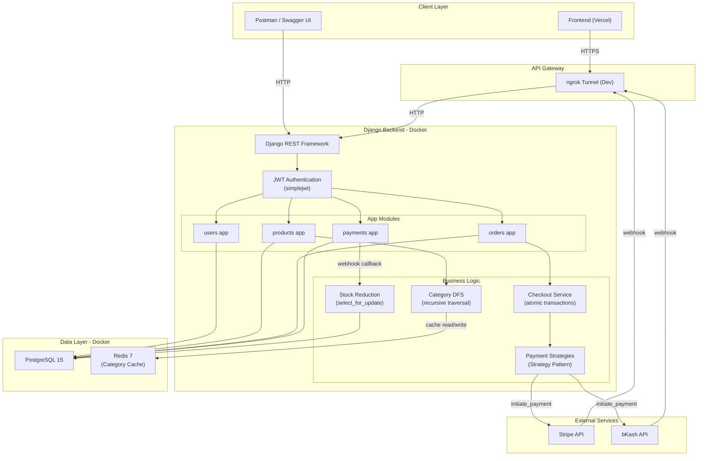

# System Architecture

## High-Level Architecture

## Component Responsibilities

### App Layer
| Module | Responsibility |
|---|---|
| `apps.users` | Custom User model, registration, JWT login, profile |
| `apps.products` | Product CRUD, Category model, DFS tree traversal, Redis caching |
| `apps.orders` | Order/OrderItem management, checkout initiation, total calculation |
| `apps.payments` | Payment model, Strategy pattern (Stripe/bKash), webhook handlers, stock reduction |

### Service Layer
| Service | Location | Purpose |
|---|---|---|
| `checkout.py` | `apps/orders/` | Atomic checkout: lock order → validate stock → initiate payment → create Payment record |
| `services.py` | `apps/orders/` | `update_order_total()` — recalculates order total from item subtotals with row locking |
| `services.py` | `apps/payments/` | `handle_payment_callback()` — processes webhooks, updates payment/order status, triggers stock reduction |
| `services.py` | `apps/products/` | `get_cached_category_tree()` — DFS traversal with Redis cache (12hr TTL) |
| `strategies.py` | `apps/payments/` | Strategy Pattern: `BasePaymentStrategy` → `StripePaymentStrategy` / `BkashPaymentStrategy` |

### Data Layer
| Store | Purpose |
|---|---|
| PostgreSQL | Primary relational database for all models |
| Redis | Cache layer for category tree (avoids repeated DFS queries) |

## Concurrency & Safety

- **Row-level locking:** `select_for_update()` on Order and Product rows during checkout and stock reduction
- **Deadlock prevention:** Items sorted by `product_id` before locking
- **Savepoint rollback:** Nested `transaction.atomic()` isolates stock reduction failures from payment status updates
- **Atomic transactions:** All multi-table writes wrapped in `transaction.atomic()`
